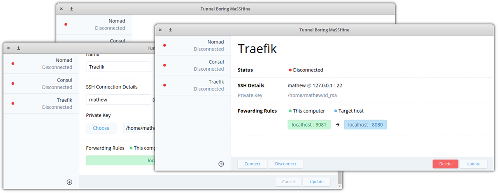

<p align="center">
  <a href="https://github.com/thepixeldeveloper/tunnel-boring-masshine">
    
  </a>

  <h3 align="center">Tunnel Boring MaSSHine</h3>

  <p align="center">
    Reliable SSH tunnels from one machine to another.
    <br />
    <br />
    <a href="https://github.com/ThePixelDeveloper/tunnel-boring-masshine/releases"><strong>Download</strong></a>
    ·
    <a href="https://github.com/thepixeldeveloper/tunnel-boring-masshine/issues">Report Bug</a>
    ·
    <a href="https://github.com/thepixeld/tunnel-boring-masshine/issues">Request Feature</a>
  </p>
</p>

## Table of Contents

* [About the Project](#about-the-project)
  * [Built With](#built-with)
* [Getting Started](#getting-started)
  * [Prerequisites](#prerequisites)
  * [Installation](#installation)
* [Roadmap](#roadmap)
* [Code of Conduct](#code-of-conduct)
* [Contributing](#contributing)
* [License](#license)
* [Contact](#contact)

## About the Project

Inspired by the lack of [Core Tunnel](https://apps.apple.com/us/app/core-tunnel/id1354318707?mt=12)
on elementaryOS, the Tunnel Boring MaSSHine is an easy way to manage SSH
tunnels on Linux, Mac _and_ Windows. This is a minimal start, so will
happily take on feature requests .

### Built With

* [Electron](https://www.electronjs.org/)
* [Electron Builder](https://www.electron.build/)
* [Vue CLI Plugin Electron Builder](https://github.com/nklayman/vue-cli-plugin-electron-builder)
* [Vuelidate](https://vuelidate.js.org/)
* [SSH2](https://github.com/mscdex/ssh2)
* [Tailwind CSS](https://tailwindcss.com/)

## Getting Started

To get a local copy up and running follow these simple steps.

### Prerequisites

This software was built using the following versions of node and yarn.

* node @ v14.9.0
* yarn @ 1.22.5

Problems running on other versions should be raised as an [issue](https://github.com/thepixeldeveloper/tunnel-boring-masshine/issues).

### Installation

1. Clone the repo
```sh
git clone https://github.com/thepixeldeveloper/tunnel-boring-masshine.git
```
2. Install yarn packages
```sh
yarn
```
3. Start the development environment
``` sh
yarn electron:serve
```

## Roadmap

See the [open issues](https://github.com/thepixeldeveloper/tunnel-boring-masshine/issues) for a list of proposed features (and known issues).

## Code of Conduct

See the [CODE-OF-CONDUCT.md](CODE-OF-CONDUCT.md). By participating in this project you agree to abide by its terms.

## Contributing

See the [CONTRIBUTING.md](CONTRIBUTING.md) guide.

## License

Distributed under the GPL v3 License. See [LICENSE](LICENSE) for more information.

## Contact

* **Email**: [ThePixelDeveloper@users.noreply.github.com](mailto:ThePixelDeveloper@users.noreply.github.com)
