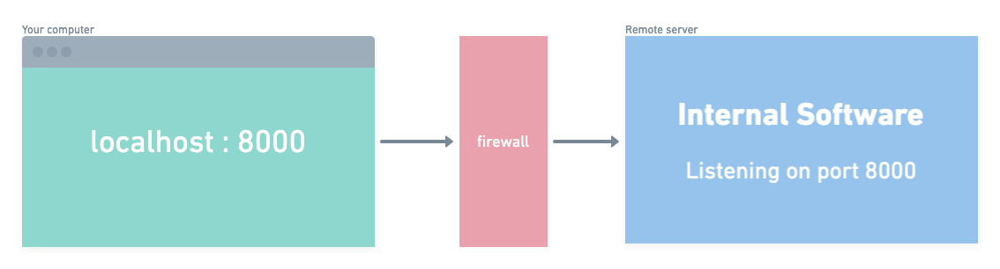

  <h2 align="center">Tunnel Boring MaSSHine</h2>

  

    Access internal server software with ease
     
     
    <strong>Download</strong> for <a href="https://github.com/ThePixelDeveloper/tunnel-boring-masshine/releases/download/v0.1.3/tunnel-boring-masshine-0.1.3.dmg">macOS</a>, <a href="https://github.com/ThePixelDeveloper/tunnel-boring-masshine/releases/download/v0.1.3/tunnel-boring-masshine-Setup-0.1.3.exe">Windows</a> and <a href="https://github.com/ThePixelDeveloper/tunnel-boring-masshine/releases/download/v0.1.3/tunnel-boring-masshine-0.1.3.AppImage">Linux (App Image)</a> 
  

## Abstract

  

Inspired by the lack of [Core Tunnel](https://apps.apple.com/us/app/core-tunnel/id1354318707?mt=12)
on elementaryOS, the Tunnel Boring MaSSHine is an easy way to manage SSH
tunnels on Linux, Mac _and_ Windows. This is a minimal start, so will
happily take on feature requests.

### Features

1. Supports local SSH tunnels (`ssh -L`)
