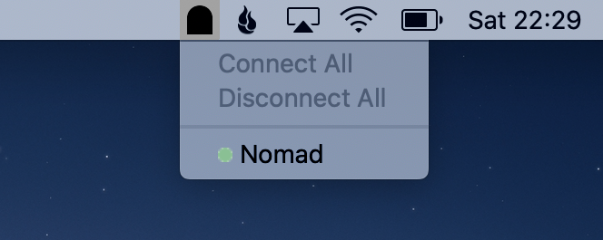

<h1 align="center">Tunnel Boring MaSSHine</h1>
<p align="center"></p>
<p align="center">Access remote server software, on your computer.</p>

<p align="center">
 Download for 
  <a href="https://github.com/ThePixelDeveloper/tunnel-boring-masshine/releases/download/v0.1.3/tunnel-boring-masshine-0.1.3.dmg">macOS</a>,  
  <a href="https://github.com/ThePixelDeveloper/tunnel-boring-masshine/releases/download/v0.1.3/tunnel-boring-masshine-Setup-0.1.3.exe">Windows</a> and
  <a href="https://github.com/ThePixelDeveloper/tunnel-boring-masshine/releases/download/v0.1.3/tunnel-boring-masshine-0.1.3.AppImage">Linux</a>

</p>

## Abstract

The Tunnel Boring MaSSHine makes it easy to manage your SSH tunnels.

No more forgetting what command line argument you need to run.

Go from running this:

```bash
ssh -L 127.0.0.1:4646:10.0.1.2:4646 192.168.1.1 \
    -o ServerAliveInterval=60 \
    -o ServerAliveCountMax=3
```

to having this:


