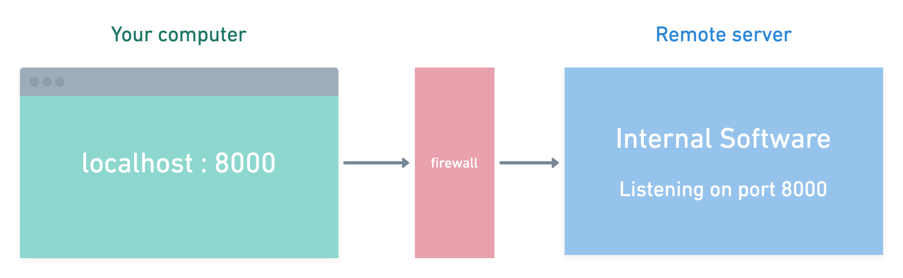

# Tunnel Boring MaSSHine

> Access remote server software, on your computer.

## Downloads

Download for [macOS](https://github.com/ThePixelDeveloper/tunnel-boring-masshine/releases/download/v0.1.3/tunnel-boring-masshine-0.1.3.dmg), [Windows](https://github.com/ThePixelDeveloper/tunnel-boring-masshine/releases/download/v0.1.3/tunnel-boring-masshine-Setup-0.1.3.exe)
 and [Linux](https://github.com/ThePixelDeveloper/tunnel-boring-masshine/releases/download/v0.1.3/tunnel-boring-masshine-0.1.3.AppImage).s

## Abstract

...

## TL;DR

  

Access remote server software, on your computer.

